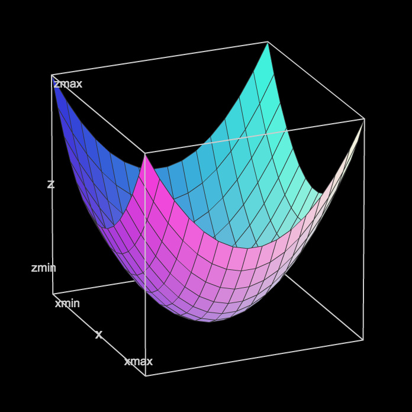
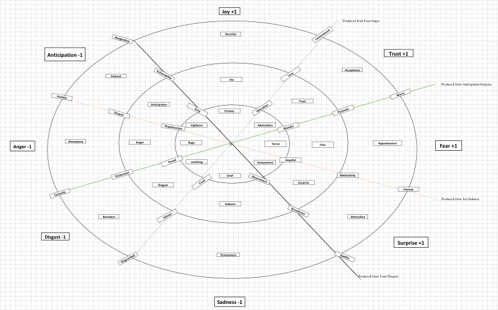
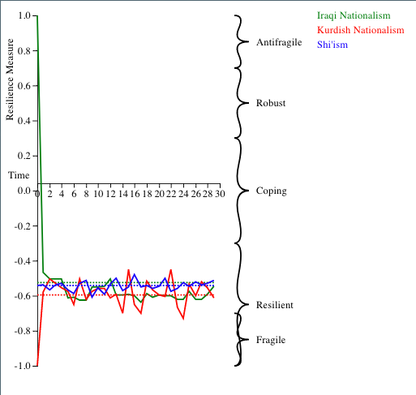
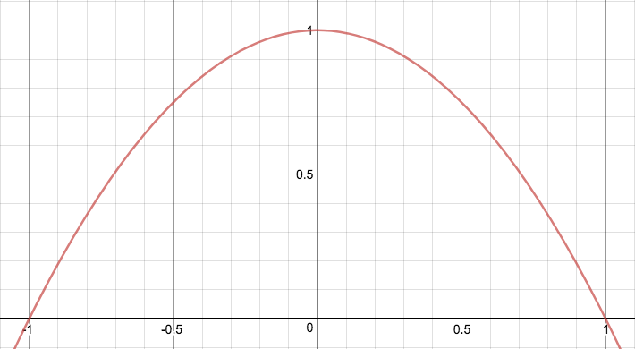

# SNA Documentation for Project Hermes 2.0
Last updated: January 15, 2018

## Contents

1. [Overview](#overview)
	1. [Requirements](#requirements)
	2. [Codebase](#codebase)
2. [Construction](#construction)
	1. [Parsing](#parsing)
	2. [Network](#network)
3. [Analysis](#analysis)
	1. [Measures](#measures)
	2. [Propensities](#propensities)
		1. [IOs](#ios)
		2. [Emotion](#emotion)
		3. [Influence](#influence)
		4. [Role](#role)
	3. [Communities](#communities)
	4. [ERGM](#ergm)
	5. [Resilience](#resilience)
4. [Forecasting](#forecasting)
	1. [DRAG](#drag)
	2. [Events](#events)
	3. [Feedback](#feedback)
5. [Utilities](#utilities)
6. [Future Features](#future-features)

## Overview

SNA is the social network analysis portion of Project Hermes 2.0. Its major features are as follows:

- constructs 2D and 3D networks based on Excel spreadsheet input from an analyst
- performs simple network analysis measures on a graph constructed using a sociology-based ontology of node classes
- performs more advanced, customized network analysis on resilience and influence community detection
- forecasts likely outcomes with stochastic probability model and psychology/political theory-based propensities model

The following documentation summarizes the use of SNA functions and the models that drive them, but does not include UI or application service functions unless they are integral to SNA core functionality or models.

### Requirements

SNA runs on Python 3.6.1 using the following core (non-utility) packages:
- [matplotlib](https://matplotlib.org/)
- [networkx](https://networkx.github.io/documentation/networkx-1.10/index.html)
- [numpy](http://www.numpy.org/)
- [pandas](https://pandas.pydata.org/)
- [scipy](https://www.scipy.org/)
- [python-louvain](https://pypi.python.org/pypi/python-louvain) (community)
- [pymc](https://pymc-devs.github.io/pymc/)

### Codebase

The core codebase for SNA is located at [`gat/core/sna/`](../gat/core/sna), and all subsequent path references will refer to this directory.

SNA is comprised of a main class object defined in `sna.py` and several helper library scripts. The following documentation will refer to library functions by attaching a Pythonic prefix (e.g. `cliques.louvain()` refers to the `louvain()` algorithm found in `cliques.py`). All other functions are SNA class methods (e.g. `python sna.__init__()`).

## Construction

The first stage of SNA parses an Excel sheet into a node list and an edge list. Each node is assigned an ontological class and attributes according to user data. A network is constructed using edges in the edge list.

### Parsing

The `excel_parser` library script provides methods for parsing the custom Excel templates used for SNA.

```python
sna.__init__(excel_file, nodeSheet[, attrSheet])
```
> On class instantiation, parses a list of nodes from a user-inputted Excel sheet and a list of attributes if provided to `SNA.list` and `SNA.attrList`, respectively (see also [excel_parser](#excel_parser)). Creates an empty directed NetworkX graph object (refer to [networkx](https://networkx.github.io/documentation/networkx-1.10/index.html) for documentation) at `SNA.G`. Also initializes several other class variables used in various methods, including lists of nodes, edges, and measure values. 
>
> *Arguments:*
>- `excel_file`: a **string** with a path to an Excel file
>- `nodeSheet`: a **string** with the name of the node sheet in that Excel file
>- `attrSheet` (optional): a **string** with the name of the attribute sheet in that Excel file

```python
excel_parser.readFile(subAttrs, excel_file, sheet)
```
> Reads a specified sheet in an SNA Excel template and return the first row (without repeats) and a list of lists, each containing dictionaries for each cell. The dictionary has two keys: 'val', the value in that cell, and 'header', the column to which that cell belongs by column title. If there are subattributes (e.g. an attribute weight), these are not included in the list of column headers. 
>
> *Arguments:*
>- `subAttrs`: a **list of strings** containing column headers that are subattributes
>- `excel_file`: a **string** with the path to an SNA Excel template
>- `sheet`: a **string** with the name of the sheet to parse)

```python
excel_parser.buildJSON(excel_file)
```
> Creates a jsonifiable dictionary in which the keys are the last-parsed cell in the second column (parsing left to right, top to bottom) and the values are lists of dictionaries. Each dictionary represents a row, where the keys are column headers and the values are cell values corresponding to each header. Repeated headers are permitted but not expected. 
>
> *Arguments:*
>- `excel_file`: a **string** path to an Excel document with a single sheet

### Network
```python
sna.createNodeList(nodeSet)
```
> Using list of **node** sheet cells generated during [instantation](#parsing), adds nodes to `SNA.G` graph object with attribute 'block' equal to the node's header in the Excel sheet (see also [excel_parser](#excel_parser)). Only includes nodes in the user-selected columns specified by `nodeSet`, and excludes repeated node names. 
>
> *Arguments:*
>- `nodeSet`: a **list** of the node columns to include in the network by column header

```python
sna.loadAttributes()
```
> Using list of **attribute** sheet cells generated during [instantation](#parsing), adds attributes to each node (the first item in each row parsed from the attribute sheet) in an attribute dictionary. The attribute dictionary has keys for each attribute type (the column headers) and values in a list. Each item in the list of values is a list with a string, the value of that attribute for that node. If there is a subattribute header assigned to that node, it is attached as part of a dictionary in the previous list. For example:

```python
attributes = {
	'Belief': [
		["Sunni'sm",{"W":0.8}],
		["Nationalism",{"W":0.1,"SENT":0.5}]
	],
	'Hair Color': ['Black'],
	...
}
```

```python
sna.createEdgeList(sourceSet)
```
> Using list of **node** sheet cells generated during [instantation](#parsing), creates directed edges between nodes occupying the same row. The node occupying the column specified by `sourceSet` is the source of each edge. Every other node in the row is the target of an edge from the node occupying the source column. If the target node is an attribute value (see `SNA.loadAttributes()`) of the source node, and that attribute has a weight, that weight is applied to the edge. 
>
>*Arguments:*
>- `sourceSet`: a **string** with the source column header

```python
sna.loadOntology(source, classAssignments[, weight])
```
> Using a user-provided set of class assignments for each column of nodes parsed during [instantation](#parsing), adds the attribute `"ontClass"` to each node with the value equal to the ontology class assigned to that node by the user. The ontology classes are hardcoded strings and can be any one of the following:
```python
ontological_elements = ["Actor","Belief","Symbol","Resource","Agent","Organization","Event","Audience","Role","Knowledge"]
```
>
> *Arguments:*
>- `source`: a **string** with the source column header
>- `classAssignments`: a **dict** of class assignments keyed by node column header **strings**
>- `weight` (optional): a **string** denoting the key used to access edge weights, if used

[- Top -](#contents)

## Analysis

The analysis phase of SNA includes several basic network measures, edge propensity analysis, a community detection function, and a resilience measurement function which uses an exponential random graph model (ERGM).

### Measures

SNA includes several basic network measures that utilize the NetworkX [API](https://networkx.github.io/documentation/networkx-1.10/index.html). Node-dependent measures output a **dict** of measures keyed by node name that are stored as SNA class variables. While not all measures are visible in the tool, the class methods for network measurement are as follows (measures for which the network is converted to an undirected networks are noted):

- System-Wide Measures
	- [`sna.center()`](https://networkx.github.io/documentation/networkx-1.10/reference/generated/networkx.algorithms.distance_measures.center.html)
	- [`sna.diameter()`](https://networkx.github.io/documentation/networkx-1.10/reference/generated/networkx.algorithms.distance_measures.diameter.html?highlight=diameter)
	- [`sna.periphery()`](https://networkx.github.io/documentation/networkx-1.10/reference/generated/networkx.algorithms.distance_measures.periphery.html?highlight=periphery)
	- [`sna.triadic_census()`](https://networkx.github.io/documentation/networkx-1.10/reference/generated/networkx.algorithms.triads.triadic_census.html?highlight=triadic_census)
	- [`sna.average_degree_connectivity()`](https://networkx.github.io/documentation/networkx-1.10/reference/generated/networkx.algorithms.assortativity.average_degree_connectivity.html#networkx.algorithms.assortativity.average_degree_connectivity)
	- [`sna.degree_assortativity_coefficient()`](https://networkx.github.io/documentation/networkx-1.10/reference/generated/networkx.algorithms.assortativity.degree_assortativity_coefficient.html#networkx.algorithms.assortativity.degree_assortativity_coefficient)
	- [`sna.node_connectivity()`](https://networkx.github.io/documentation/networkx-1.10/reference/generated/networkx.algorithms.connectivity.connectivity.node_connectivity.html#networkx.algorithms.connectivity.connectivity.node_connectivity)
	- [`sna.average_clustering()`](https://networkx.github.io/documentation/networkx-1.10/reference/generated/networkx.algorithms.approximation.clustering_coefficient.average_clustering.html?highlight=average%20clustering#networkx.algorithms.approximation.clustering_coefficient.average_clustering) (undirected)
	- [`sna.attribute_assortativity(attr)`](https://networkx.github.io/documentation/networkx-1.10/reference/generated/networkx.algorithms.assortativity.attribute_assortativity_coefficient.html#networkx.algorithms.assortativity.attribute_assortativity_coefficient) (`attr` is a **string** with the key of the attribute to be analyzed)
	- [`sna.is_strongly_connected()`](https://networkx.github.io/documentation/networkx-1.10/reference/generated/networkx.algorithms.components.strongly_connected.is_strongly_connected.html?highlight=strongly%20connected#networkx.algorithms.components.strongly_connected.is_strongly_connected)
	- [`sna.is_weakly_connected()`](https://networkx.github.io/documentation/networkx-1.10/reference/generated/networkx.algorithms.components.weakly_connected.is_weakly_connected.html?highlight=weakly%20connected#networkx.algorithms.components.weakly_connected.is_weakly_connected)
- Node-Dependent
	- [`sna.clustering()`](https://networkx.github.io/documentation/networkx-1.10/reference/generated/networkx.algorithms.bipartite.cluster.clustering.html?highlight=clustering#networkx.algorithms.bipartite.cluster.clustering)
	- [`sna.latapy_clustering()`](https://networkx.github.io/documentation/networkx-1.10/reference/generated/networkx.algorithms.bipartite.cluster.latapy_clustering.html?highlight=latapy_clustering#networkx.algorithms.bipartite.cluster.latapy_clustering)
	- [`sna.robins_alexander_clustering()`](https://networkx.github.io/documentation/networkx-1.10/reference/generated/networkx.algorithms.bipartite.cluster.robins_alexander_clustering.html?highlight=robins#networkx.algorithms.bipartite.cluster.robins_alexander_clustering)
	- [`sna.closeness_centrality()`](https://networkx.github.io/documentation/networkx-1.10/reference/generated/networkx.algorithms.centrality.closeness_centrality.html#networkx.algorithms.centrality.closeness_centrality)
	- [`sna.degree_centrality()`](https://networkx.github.io/documentation/networkx-1.10/reference/generated/networkx.algorithms.centrality.degree_centrality.html#networkx.algorithms.centrality.degree_centrality)
	- [`sna.betweenness_centrality()`](https://networkx.github.io/documentation/networkx-1.10/reference/generated/networkx.algorithms.centrality.betweenness_centrality.html#networkx.algorithms.centrality.betweenness_centrality)
	- [`sna.eigenvector_centrality()`](https://networkx.github.io/documentation/networkx-1.10/reference/generated/networkx.algorithms.centrality.eigenvector_centrality.html#networkx.algorithms.centrality.eigenvector_centrality)
	- [`sna.katz_centrality()`](https://networkx.github.io/documentation/networkx-1.10/reference/generated/networkx.algorithms.centrality.katz_centrality.html#networkx.algorithms.centrality.katz_centrality)
	- [`sna.load_centrality()`](https://networkx.github.io/documentation/networkx-1.10/reference/generated/networkx.algorithms.centrality.load_centrality.html#networkx.algorithms.centrality.load_centrality)
	- [`sna.communicability_centrality()`](https://networkx.github.io/documentation/networkx-1.10/reference/generated/networkx.algorithms.centrality.communicability_centrality.html#networkx.algorithms.centrality.communicability_centrality)

```python
sna.set_property()
```
> Calls all the system-wide measures.

```python
sna.sentiment(types, key[, operation])
```
> A node-dependent custom measure that iterates through all node attributes and sums the weight towards every node of the given types. If `operation` is set to `"average"`, the weights are averaged instead. 
>
> *Returns:*
>- a **dict** of sentiment values keyed by node
>
> *Arguments:*
>- `types`: a **list** of **strings**, one for each ontology class to be analyzed (e.g. `"Belief"`)
>- `key`: a **string** with the attribute key containing the weight to be analyzed (e.g. `"W"`)
>- `operation` (optional): a **string** with the operation to be performed (one of `"sum"` or `"average"`)

[- Top -](#contents)

### Propensities

The propensities model assigns *a priori* probabilities and descriptions to edges in the network based on the attributes and properties of dyads. Specifically, propensities are formulated using attributes and the Intersubjective Orientation vector, which contains values representing the level of five different qualities of a subjective relationship: 
- [Warmth](#warmth)
- [Affiliation](#affiliation)
- [Legitimacy](#legitimacy)
- [Dominance](#dominance)
- [Competence](#competence)

Specifically, propensities are split into three independent categories:
- [Emotion](#emotion)
- [Influence](#influence)
- [Role](#role)

```python
sna.calculatePropensities([propToggle])
```
> The primary class method for calculating propensities. Iterates through network edges and assigns propensity calculation output (see `propensities.propCalc`) in the attribute dictionary (see also [attribute assignment](#network)). Filters which propensities are included based on user toggle input.
>
> *Arguments:*
>- `propToggle` (optional): a **dict** keyed by propensity type (one of `"emo"`, `"infl"`, or `"role"`) with Boolean values (`True` if propensity should be calculated, else `False`)

```python
propensities.propCalc(graph, edge[, propToggle])
```
> For a given edge, calculates IO (see [IOs](#ios)) and required propensity types using helper functions (see [Emotion](#emotion), [Influence](#influence), and [Role](#role)).
>
>*Returns:*
>- a **dict** keyed by IO descriptor (e.g. `"Warmth"`) with values for each IO calculated
>- a **list** of [emotional](#emotional) propensities
>- a **list** of [influence](#influence) propensities
>- a **list** of [role](#role) propensities
>
> *Arguments:*
>- `graph`: a NetworkX **graph object**
>- `edge`: a **tuple** containing two **strings**, one for each node name in the dyad to be analyzed
>- `propToggle` (optional): a **dict** keyed by propensity type (one of `"emo"`, `"infl"`, or `"role"`) with Boolean values (`True` if propensity should be calculated, else `False`)

#### IOs

```python
propensities.ioCalc(graph, source, target)
```
> A helper function used to calculate intersubjective orientation (IO) for a directed dyad. First creates a **list** of random floats, one for each IO value, then assigns new floats to each place according to their respective model (see [Warmth](#warmth), [Affiliation](#affiliation), [Legitimacy](#legitimacy), [Dominance](#dominance), and [Competence](#competence)). Uses globally stored list of IO descriptors to generate a verbose output **dict** as well as a condensed **list**:
```python
IO_keys = ["Warmth", "Affiliation", "Legitimacy", "Dominance", "Competence"]
```
>
>*Returns:*
>- a **list** of floats, one for each IO value, from -1 to 1
>- a **dictionary** with the same length, keyed by **strings** describing each value, where values are **floats**
>
>*Arguments:*
>- `graph`: a NetworkX **graph object**
>- `source`: a **string** with the name of source node in dyad
>- `target`: a **string** with the name of target/subject node in dyad

##### Warmth

Warmth is simply the affect of the source node towards the target node, accessed by iterating through every attribute value in the source node's attribute **dict** and checking for the name of the target node. If both the target node's name and a subattribute `"W"` are present, the value of `"W"` is added to the IO **list** as warmth.

##### Affiliation

Affiliation is the *average index weight* of affect towards any shared attribute value (e.g. `"Nationalism"`). Index weight is calculated according to the following equation, which creates a hyperboloid from -1 to 1 in all dimensions:
```python
w_index = w_src ** 2 + w_trg ** 2 - 1
```


A combination of any two extreme affects will produce an accordingly extreme affect index weight (either positive or negative).

##### Legitimacy

Legitimacy accounts for the network-wide sentiment towards various attributes that are also represented as nodes in the network. Using the `sna.sentiment` function (see [Measures](#measures)), the average sentiments for all nodes with acceptable ontology classes for legitimacy measurement are calculated. Currently, the acceptable ontology classes are defined by a global variable:
```python
legit_keys = ["Title","Role","Belief","Knowledge"]
```
If a node belonging to one of these classes appears in the source node's attribute **dict**, it is given a percentile according to the distribution of average sentiments across all nodes for which average sentiment was calculated. This percentile is rescaled. Once all relevant attributes are scored and rescaled, legitimacy is assigned the average percentile average sentiment towards nodes appearing in the source node's attributes.

##### Dominance

Dominance is simply the source node's average percent share of a network resource. Network resources belong to ontology classes defined by a global variable:
```python
dom_keys = ["Resource","Knowledge"]
```
Total resource amounts are collected using the `sna.sentiment` function (see [Measures](#measures)) where the types assessed are given by `dom_keys` and the attribute key used is `"AMT"`. The final resource share is rescaled from [0,1] to [-1 to 1].

##### Competence

Competence is assigned randomly for each dyad pending progress on Task Models for SNA.

#### Emotion

Emotion propensities are aggreggated in two stages.

For every neighboring event, a "simple" emotion is collected according to the CAMEO category of that event. The CAMEO-emotion associations are provided by an Excel spreadsheet, reproduced below and stored in the global variable `emo_key`:

|CAMEO Category|Emotion|
|---|---|
|Assault|Rage|
|Use unconventional mass violence|Terror|
|Fight|Anger|
|Coerce|Vigilance|
|Exhibit force posture|Amazement|
|Reduce relations|Disgust|
|Threaten|Fear|
|Reject|Loathing|
|Disapprove|Surprise|
|Investigate|Interest|
|Control information|Distraction|
|Yield|Acceptance|
|Protest|Grief|
|Refuse to build infrastructure|Sadness|
|Demand|Annoyance|
|Appeal|Acceptance|
|Make a public statement|Interest|
|Build energy infrastructure|Trust|
|Build social infrastructure|Trust|
|Build political infrastructure|Trust|
|Build military infrastructure|Trust|
|Build information infrastructure|Trust|
|Build economic infrastructure|Trust|
|Gather/mine for materials|Joy|
|Change price|Apprehension|
|Government funds|Joy|
|Express intent|Pensiveness|
|Appeal to build infrastructure|Trust|
|Express intent to cooperate|Joy|
|Express intent to build infrastructure|Serenity|
|Consult|Admiration|
|Accede|Ecstasy|
|Use social following|Anticipation|
|Demand to build infrastructure|Anticipation|
|Engage in material cooperation|Admiration|
|Engage in diplomatic cooperation|Ecstasy|
|Provide aid|Ecstasy|

Each of these emotions can be placed on Plutchik's wheel of emotions as in the diagram below.


An emotion is positioned on any of three concentric circles and is surrounded by two "refined" emotions. 

To determine which of the two "refined" emotions is associated with a neighboring event, threat level is calculated. Threat level depends on the IO values of Warmth and Competence. Here, **high** is defined as any positive value, while **low** is any negative value.

|Warmth\Competence|High|Low
|---|---|---|
|**High**|`threat = -1`|`threat = 0`|
|**Low**|`threat = 1`|`threat = 0`|

This threat level determines which direction the "simple" emotion will "snap" to determine a "refined" emotion. Put simply, a higher threat pushes emotion towards the Fear/Anger axis.

Programmatically, the snapping function separates all possible emotions into six semicircles spanning from Fear to Anger on each side of each tier. These semicircles are stored as **lists** in a global **dict** keyed by tier:
```python
threatRanking = {
    "low":[
        [
	        "Annoyance", "Anxiety","Interest","Resignation","Serenity",
	        "Content","Acceptance","Worry", "Apprehension"
        ],
        [
	        "Annoyance", "Curiosity","Boredom","Disgruntled","Pensiveness",
	        "Apathy","Distraction","Dismay", "Apprehension"
        ]
    ],
    "medium": [
        [
	        "Anger","Despair","Anticipation","Vulnerability","Joy",
	        "Love","Trust","Paranoia","Fear"
        ],
        [
	        "Anger","Excitement","Disgust","Hatred","Sadness",
	        "Broodiness","Surprise","Melancholy","Fear"
        ]
    ],
    "high": [
        [
	        "Rage","Hopeless","Vigilence","Envy","Ecstasy",
	        "Adoration","Admiration","Wonder","Terror"
        ],
        [
	        "Rage","Dread","Loathing","Cruel","Grief",
	        "Resentment","Amazement","Hopeful","Terror"
        ]
    ]
}
```
For each list, lowest index is closest to anger, while the highest index is closest to fear.

If threat level is high, the "simple" emotion snaps to the neighboring "refined" emotion that is closest to the Fear/Anger axis. If threat level is low, the "simple" emotion snaps to the neighboring "refined" emotion that is farthest from the Fear/Anger axis. The distance from the axis is determined by index level in the semicircle list. If threat level is medium, there is a 50% chance the "simple" emotion will snap to either neighboring "refined" emotion.

Thus, every neighboring event produces a simple emotion, which is snapped to a refined emotion. A given node has as many emotion propensities as there are neighboring events.

```python
propensities.emoCalc(G, edge, IO)
```
> A helper function that uses the model above to formulate a **list** of subjective emotions within a dyad. Finds all source node neighbors that are also event nodes and gets the emotion associated with each event. The emotion associations are provided by a spreadsheet stored globally as JSON (`GAT/static/sample/sna/CAMEO-Emotion.xlsx`) which is parsed using the `excel_parser.buildJSON` function (see [Parsing](#parsing)). Refines emotion using snapping function (above). Outputs a list of refined emotions, one for each neighboring event.
>
>*Returns:*
>- a **list** of **strings**, each with one refined emotion
>
>*Arguments:*
>- `G`: a NetworkX **graph object**
>- `edge`: a **tuple** containing two **strings**, one for each node name in the dyad to be analyzed
>- `IO`: a **list** of floats, one for each IO value, from -1 to 1

#### Influence

Influence propensities have six components, each represented by a numerical value from -1 to 1:
- Reciprocity
- Commitment
- Social proof
- Authority
- Liking
- Scarcity

Each component is determined by a weighted average of the IO values, where the weights are provided by the table below (stored in the global variable `infl_weight_table`). Weights are chosen randomly from a range of values, also provided below.
```python
## weights ##
A = (-.8,-.6)
B = (-.6,-.3)
C = (-.3,.3)
D = (.3,.6)
E = (.6,.8)
```

| | Warmth | Affiliation | Legitimacy | Dominance | Competence |
|---|---|---|---|---|---|
| **Reciprocity**  |D|D|C|D|D|
| **Commitment**   |D|B|C|A|C|
| **Social Proof** |B|A|B|A|B|
| **Authority**    |B|B|D|A|D|
| **Liking**       |E|D|D|B|D|
| **Scarcity**     |C|B|C|B|B|

The meaning of a particular influence propensity (e.g. Reciprocity) is derived from the arrangement of weights used to produce it. For example, the IO value "Warmth" matters much more to the influence propensity "Liking" than it does to "Authority".

Each influence propensity is represented by a single numerical value, which is the weighted average of all five IO values using a random weight selection from the ranges provided for that particular influence propensity.

```python
propensities.inflCalc(IO)
```
> A helper function that uses the model above to generate vectors of six weighted average values each, one for each influence propensity. Adds to a verbose dictionary keyed by influence propensity.
>
>*Returns:*
>- a **dict** keyed by **strings** with influence propensity descriptors, where values are floats from -1 to 1
> 
>*Arguments:*
>- `IO`: a **list** of floats, one for each IO value, from -1 to 1

#### Role

Role propensities operate on a similar weighted average, but take into account the role of both the source and target nodes. Thus, role propensities depend on both IO and the roles of each node in the dyad.

Stored in the global **list** `role_weight_table`, the following table establishes the weight ranges for any combination of roles. Each list corresponds to the five IO values (sequentially, [Warmth](#warmth), [Affiliation](#affiliation), [Legitimacy](#legitimacy), [Dominance](#dominance), and [Competence](#competence)).
```python
## weights ##
A = (-.8,-.6)
B = (-.6,-.3)
C = (-.3,.3)
D = (.3,.6)
E = (.6,.8)

IO_keys = ["Warmth", "Affiliation", "Legitimacy", "Dominance", "Competence"]
```

| | Hegemon | Revisionist | Ally | Defender of the Faith | Dependent | Independent | Mediator | Isolationist |
|---|---|---|---|---|---|---|---|---|
| **Hegemon**  |[B,B,D,A,D]|[A,A,B,B,C]|[E,D,D,D,D]|[C,B,B,C,B]|[D,C,B,E,C]|[C,B,A,A,B]|[C,C,C,B,C]|[D,C,B,D,C]
| **...**  | ... | ... | ... | ... | ... | ... | ... | ... |
| **Isolationist**  |[C,B,D,A,C]|[A,A,C,A,B]|[C,B,C,C,B]|[B,A,B,B,B]|[A,B,A,D,A]|[D,B,D,B,D]|[B,C,C,B,C]|[C,C,D,B,C]|

The weight ranges for a given role pairing are used to take a weighted average of the IO values for a given dyad, producing the role weight. Role labels depend on the role weight. For every role pairing, there are two possible role labels, provided in the table below:

| | Hegemon | Revisionist | Ally | Defender of the Faith | Dependent | Independent | Mediator | Isolationist |
|---|---|---|---|---|---|---|---|---|
| **Hegemon**  |Facilitator/Belligerent|Facilitator/Belligerent|Protector/Provacateur|Protector/Provacateur|Provider/Provacateur|Facilitator/Supporter|Facilitator/Facilitator|Protector/Protector|
| **...**  | ... | ... | ... | ... | ... | ... | ... | ... |
| **Isolationist**  |Facilitator/Provacateur|Facilitator/Belligerent|Facilitator/Belligerent|Facilitator/Provacateur|Facilitator/Provacateur|Supporter/Provacateur|Belligerent/Provacateur|Supporter/Supporter|

If the role weight is positive, the first role label is used. If role weight is negative, the second role label is used.

For each dyad, one role weight is calculated and one role label is determined.

```python
propensities.roleCalc(IO, roles)
```
>A helper function which calculates role weighted average and role label according to the method described above. Outputs a simple tuple (not verbose).
>
>*Returns:*
>- a **string** with the role label (see table above)
>- a **float**, the weighted average of the IO values
>
>*Arguments:*
>- `IO`: a **list** of floats, one for each IO value, from -1 to 1
>- `roles`: a **tuple** containing two **strings** describing the role of the source node and target node, sequentially

### Communities

Influence communities are detected using the [Louvain](https://arxiv.org/abs/0803.0476) algorithm. The Louvain algorithm is a modularity optimization technique used to create communities of nodes with high intracommunity edge density and low intercommunity edge density.

SNA community detection utilizes two stages of community detection. First, a Louvain algorithm partitions the general network of all nodes based on raw edges. Second, a core myth-symbol complex consisting of Belief, Symbol, Event, or Role nodes within each partition is identified.

Each identified community is labelled by the most central node in its myth-symbol complex.

```python
sna.communityDetection()
```
> The primary class method for community detection. Ensures eigenvector centrality analysis is complete and converts `sna.G` to an undirected network (the Louvain algorithm does not support directed edges).
>
>*Returns:*
>- a **list** of graph objects (the identified communities as subgraphs)
>- a **list** of **strings** containing the labels for each subgraph

```python
communities.louvain(G[, weightKey, centralities])
```
> The modified two-step weighted Louvain algorithm for SNA, using the model above. Uses `best_partition` algorithm from [python-louvain](https://pypi.python.org/pypi/python-louvain) package, rearranges messy data return type, and constructs a subgraph for each community. Labels subgraphs using eigenvector centrality of core community nodes, or by first node listed if centrality is not available.
>
>*Returns:*
>- a **list** of graph objects (the identified communities as subgraphs)
>- a **list** of **strings** containing the labels for each subgraph
>
>*Arguments:*
>- `G`: a NetworkX **graph object**
>- `weightKey` (optional): a **string** with the edge attribute to be used as a weight in the algorithm
>- `centralities` (optional): a **dict** of **floats** for centrality values, keyed by node name

[- Top -](#contents)

### ERGM

Exponential random graph models (ERGMs) comprise a stochastic network statistics technique intended to estimate certain network properties. Traditional statistical practices like linear regression are not suitable for networks because network data is inherently relational. The most useful explanations of ERGM in Python can be found [here](http://socialabstractions-blog.tumblr.com/post/53391947460/exponential-random-graph-models-in-python) and [here](https://gist.github.com/dmasad/78cb940de103edbee699).

From a [full description](resources/drag.pdf) of ERGMs in SNA:

>The proper ERGM provides us with the means to estimate the coefficients associated with any network statistic we decide to measure; i.e., it tells us how important each statistic is to the original network's structure. If we change the structure of the network, how do the network statistics change in response? How does the probability of observing that network change?
>
>Once we know the importance of each statistic to our network's character, we can pick the edges that fit our network's structure best. The only knowledge we need beforehand is the adjacency matrix (the current structure) for our network and what measures might be salient to our network's structure, and how much we want it to retain that structure.
>
>Therefore, ERGM is essentially a tool to prevent our network from going off the rails. It keeps the structure roughly the same by ensuring that new edges best preserve the character of the network, where the character is composed of the statistics we choose.
>
>The probability of a particular adjacency matrix given a vector of coefficients can be estimated using covariates like these:
>- **mutual tie count**: # of reciprocative ties
>- **density** (1-instar count): number of edges in the network
>- **2-instar count**: number of nodes that are the target of two edges
>- **3-instar count**: number of nodes that are the target of three edges
>- **2-outstar count**: number of nodes that are the source of two edges

>Specifically, each covariate is the change in one of the statistics above for two cases: the case in which the edge in question is present in the graph, and the case in which it is not.
>
>For even the simplest network, there are a very high number of possible configurations that must be calculated to achieve a perfectly normalized statistic.
>
>A Monte Carlo metropolis chain (MCMC) algorithm takes the matrix of probabilities for each individual edge resulting from the product of the vector of coefficients and the vector of network statistics and uses it to estimate the normalized coefficients for a network given all possible networks. Specifically, the MCMC explores the most probable areas of the parameter space (where the parameters are the covariates defined above), sampling the areas of the parameter space where conditional probabilities are high and ignoring the areas where conditional probabilities are low.
>
>How does the MCMC discern higher relative weights from lower relative weights? For each edge represented in the conditional probability matrix produced above, the random variable is distributed across a Bernoulli distribution. Since a Bernoulli distribution is a binomial distribution with only a single trial, a matrix of these random variable distributions will contain only 0s and 1s, successes and failures, edge presences and edge absences. Thus, the matrix of random variables O can be realized as the adjacency matrix for an observable network. The MCMC model is [instantiated](https://pymc-devs.github.io/pymc/modelfitting.html#chap-modelfitting) with the matrix of random variables as the observed graph to fit (our priors) and the list of coefficients as the parameters to estimate. For a set number of iterations, the MCMC returns the optimized (maximum likelihood) coefficient values and the probability of observing the adjacency matrix given the set of fitted parameters. To produce a random realization/instance of the network, a random realization from the posterior distribution can be drawn (after fixing the optimized coefficients).

ERGM is not a standalone feature, but is used in the [Analysis](#analysis) and [Forecasting](#forecasting) portions of the tool.

```python
ergm.probability(G)
```
> A helper function that initiates a Monte Carlo Markov Chain (MCMC) for probability estimation (see [DRAG](#drag). Generates default parameters (see `ergm.calc_params`), runs a 3000 iteration estimation with a burn-in of 1000, and estimates default coefficients.
>
>*Returns:*
>- A **2D numpy array** of edge probabilities, arranged as an adjacency matrix
>
>*Arguments:*
>- `G`: a NetworkX **graph object**

```python
ergm.resilience(G,iters,mu)
```
> A helper function that initiates an MCMC for parameter tracing (see [Resilience](#resilience)). Generates customized resilience parameters (see `ergm.calc_params`), records ERGM trace (see `ergm.trace`). Skips estimation step and does not use a burn-in period. Accepts custom iterations and custom *mu* for priors.
>
>*Returns:*
>- A **dict** of traces, keyed by **strings** for each parameter; values are **lists** of **floats**
>
>*Arguments:*
>- `G`: a NetworkX **graph object**
>- `iters`: the number of MCMC iterations
>- `mu`: the mean for prior parameters for the MCMC

```python
ergm.calc_params(G[, type])
```
> A helper function which specifies the parameters/coefficients to use for the MCMC model. Coefficients are network measures. Different coefficients are returned for [resilience](#resilience) and the [DRAG](#drag) model, depending on model specs.
>
>*Returns:*
>- A **dict** of coefficients, keyed by coefficient label (a **string**) with **2D numpy arrays** outputted from coefficient calculators as values.
>
>*Arguments:*
>- `G`: a NetworkX **graph object**
>- `type` (optional): a **string** specifying the type of MCMC to be run (one of `"resilience"` or `"drag"`)

```python
ergm.trace(matrix,params,iters,burn[,mu])
```
> A helper function which instantiates and runs MCMC. Creates coefficients using parameter input and prior normal distributions. Calculates probabilities using an likelihood function described [here](resources/drag.pdf). Since probabilities sometimes output negative infinity depending on the priors, the model often attempts calculation multiple times. A Bernoulli distribution is used to simulate an outcome graph realization. The MCMC is instantiated with the true outcome (the probability based on the observed graph), a simulated outcome (the probability without an observed graph), an array of probabilites estimated by the model, and priors for each coefficient. The [pymc](https://pymc-devs.github.io/pymc/) package is used for the MCMC model. Returns the traces for each coefficient and also conducts a goodness of fit analysis.
>
>*Returns:*
>- A **dict** of traces, keyed by **strings** for each parameter; values are **lists** of **floats**
>
>*Arguments:*
>- `matrix`: a **2D numpy array** containing the adjacency table for the current graph
>- `params`: a **dict** of coefficients, keyed by coefficient label (a **string**) with **2D numpy arrays** outputted from coefficient calculators as values (see `ergm.calc_params()`)
>- `iters`: the number of iterations to run, an **int**
>- `burn`: the length of the burn-in period (not counted in the trace, brings the model to a higher probability region before estimating), an **int**
>- `mu` (optional): the mean of the prior probability distributions, a **float**

`ergm.py` also contains service functions with straightforward uses in the above methods. They are as follows:
- Utilities
	- `ergm.draw_init` - draw the initial graph, if required (not used)
	- `ergm.create_coefs` - generate coefficient info for MCMC model
	- `ergm.diagnostics` - produce the traces and a Matlab graph of trace (not present in UI), saves image to `GAT/out/sna/ergm/diagnostics.png`
	- `ergm.goodness_of_fit` - a goodness of fit test for the MCMC, produces a random new instantiation of the graph at `GAT/out/sna/ergm/new.png`
	- `ergm.coefs_to_prob` - uses a logistic function to produce a probability for each coefficient for inclusion in the MCMC
- Calculators
	- `ergm.aspl` - average shortest path length
	- `ergm.edge_count` - basic density
	- `ergm.node_match` - the probability of nodes of different ontology classes to share an edge
	- `ergm.istarDelta` - number of groups sharing *i* mutual in-star edges
	- `ergm.ostarDelta` - number of groups with *i* "out" edges

[- Top -](#contents)

### Resilience

Resilience measures and visualization are based on a network perturbation and an [ERGM](#ergm) probability trace. First, [community detection](#communities) is used to identify all communities in the network. For each community, a system shock is delivered such that 10% of edges and nodes are removed at random. After the shock, an ERGM is run to trace the estimation of a network measure (e.g. Average Shortest Path Length) from the time of perturbation to a number *n* iterations after which the network is assumed to be stable. Since the ERGM alters network composition at random, the ERGM effectively simulates the random probability of improvement or decline in a given network measure after a system shock.

The ERGM trace is the medium of analysis for resilience, as in the example below.



A line graph displaying every 10 iterations of the ERGM is used to visualize the estimation of each subgraph, labelled by its most central node. Each subgraph is a community in the network. The resilience of each community can be compared and assessed by the regions on the right side of the graph, from fragile to anti-fragile. A relative scale is used to ensure that these regions are applicable in many cases, though without an aboslute scale it is difficult to compare vastly different cases.

```python
sna.calculateResilience()
```
> The primary class method for resilience calculation. First, calls `sna.communityDetection()` to identify communities for analysis. Next, uses helper functions (see `resilience.resilience`) to calculate baseline measure, simple resilience, and the trace (used for graphing).
>
>*Returns:*
>- a **dict** keyed by subgraph central node name (a **string**), where values are the percentile baseline measure for that community among all communities in the graph
>- a **dict** keyed by subgraph central node name (a **string**), where values are the percentile simple resilience measure for that community among all communities in the graph
>- a reformatted **dict** of traces keyed by central node name (a **string**); each value is a **dict**, keyed by measure (a **string**) with lists of **floats** representing the measure at every 10 iterations as values

```python
resilience.resilience(cliques_found[, ergm_iters])
```
> A helper function for resilience community iteration and calculation. Finds baseline (original) network measures, simple resilience (the difference between the new equilibrium measure and the original), and ERGm trace for each community after delivering a system shock, removing some percentage of nodes. Once measurements are made, creates percentile scores for baseline and simple resilience based on measurements for all communities in the network (accomplished with the [numpy](http://www.numpy.org/) package). Reformats traces into a labelled dictionary.
>*Returns:*
>- a **dict** keyed by subgraph central node name (a **string**), where values are the percentile baseline measure for that community among all communities in the graph
>- a **dict** keyed by subgraph central node name (a **string**), where values are the percentile simple resilience measure for that community among all communities in the graph
>- a reformatted **dict** of traces keyed by central node name (a **string**); each value is a **dict**, keyed by measure (a **string**) with lists of **floats** representing the measure at every 10 iterations as values
>
>*Arguments:*
>- `cliques_found`: a **list** of NetworkX **graph objects**, each a subgraph representing a community in the network
>- `ergm_iters`: an **int** specifying the number of iterations to run the trace

[- Top -](#contents)

## Forecasting

The most powerful tools in SNA forecast the effect of external influence (an interference by the user) on a network based on that network's properties and composition. The core forecasting model in SNA is the Derivative Relational Attribute Graph Model (DRAG), which forecasts the presence of edges in a network based on [propensities](#propensities) and overall network characteristics and dynamically adjusts the network composition. The DRAG model is assisted by feedback loops, which adjust node attribute weights based on system-wide weights towards nodes in the network, thereby altering propensities and other analyses. The combination of DRAG and feedback loops accurately propagates the effects of even the smallest network interferences in an effort to reflect the extraordinary complexity of networked systems.

### DRAG

The DRAG model converts the probability output of ERGM estimation into a matrix of edge-specific probabilities and combines it with propensities to produce a matrix of probabilistic edge forecasts. An excerpt from the full [description](resources/drag.pdf) of the DRAG model:

>The DRAG model combines the probability matrix
output of these two models into single generative model for link prediction. This model will take an observed
network, containing nodes with attributes, and produce a single, combined link probability adjacency matrix
based on parameter estimation by both the ERGM and the MAG model. By combining both the models
above, we produce a new network that reflects both the original system characteristics and the interaction
between roles and attributes we seek to model.

Specifically, the DRAG model uses an log-odds function to generate edge probabilites from the ERGM network-wide coefficient probability estimations. Once propensity weights are used to fine-tune the edge weights from the ERGM, a Bernoulli sampling distribution is applied to the final probability matrix to determine a final network structure.

```python
sna.drag_predict([node])
```
> The primary class method for DRAG link prediction. Generates an ERGM probability matrix with a helper function (see `ergm.probability`). Calculates propensities for a new node if one is being added. Iterates through all node propensities and adjusts directed edge probability based on emotional propensities found. Uses the weighting function `(prob + w_avg * 0.5) / 2` to combine ERGM edge probability and average emotional propensity weight. Chooses outcome with random binomial (Bernoulli) sample and adds edges if necessary. Conducts a feedback update (see `sna.feedbackUpdate`). Also adds a flag to new edges so that they will be colored red in JGraph.
>
>*Arguments:*
>- `node` (optional): a **string** with the name of the node being added, if necessary

```python
sna.addNode(node[, attrDict, connections])
```
> The primary method for adding nodes to the graph. Appends a node to the SNA **graph object** with an attribute **dict** (see [section](#network) on loading attributes), if provided, and edges, if provided. Also updates the SNA class object stored node list and edge list.
>
>*Arguments:*
>- `node`: a **string** with the name of the node to be added
>- `attrDict` (optional): a **dict** containing the attributes of the new node (see [Network](#network) for data format)
>- `connections`: a **list** of **strings** with the target node names for each user-provided edge

```python
sna.removeNode(node)
```
> The primary method for removing nodes from the graph. Removes the specified node from the SNA **graph object** along with any edges it shares. Also updates the SNA class object stored node list and edge list.
>
>*Arguments:*
>- `node`: a **string** with the name of the node to be removed

### Events

The event update mechanism inserts nodes for events provided in a spreadsheet and measures their effects on network sentiments towards nodes. Specifically, the mechanism outputs the change in sentiment sum towards a node of a given set of ontology classes in the network. *(Author: Miles Latham)*

```python
sna.event_update(event_sheet, max_iter)
```
> The primary class method for spreadsheet-derived event addition. Parses an Excel sheet with hardcoded city population requests (customized for Iranian Influence case) and adds sentiment outputs to a **dict**. Only adds events within a certain time period, calculated based on the number of iterations to be calculated. Also updates the SNA class object stored node list and edge list.
>
>*Returns:*
>- a **list** of **lists**, each containing **strings** describing the sentiment change as a result of the addition of various events
>
>*Arguments:*
>- `event_sheet`: a **string** with the path to the Excel sheet of events to be added
>- `max_iter`: the maximum number of time iterations to include

### Feedback

Feedback loops relate the weight of an individual node's attribute value (e.g. the Belief "Nationalism") to the system-wide weight towards that attribute value's matching node (e.g. the "Nationalism" node) in the network. 

If a matching node is present in the network for a given attribute value, the individual node's weight towards that attribute value is combined with the system-wide average weight towards the matching node. The weight given to the individual node's attribute value weight is dependent on the node's attribute value weight. According to the following function, if the individual node weight is extreme, its weighting will be much higher than the system-wide node weight, and vice versa:
```python
globalWeighting = nodeAttrWeight**2
weightedAverage = (1-globalWeighting)*nodeAttrWeight + (globalWeighting)*globalNodeWeight
```


In the graph above, the individual node attribute value weight is on the x-axis, while the weighting for the system-wide node weight is on the y-axis.

```python
sna.feedbackUpdate()
```
> The primary class method for attribute weight update feedback loops. Measures average sentiment for all nodes, then iterates through all individual node attributes and combines invidual attribute weights with global averages according to the function above. Also updates [propensities](#propensities), since individual attribute weights have changed.

[- Top -](#contents)

## Utilities

There are several simple utility functions used for the functions above and present in the UI.

```python
sna.changeAttribute(node, value, attribute)
```
> A simple function for setting a node attribute.
>
>*Arguments:*
>- `node`: a **string** with the name of the node to be edited
>- `value`: any **object** to be set as the value of the attribute chosen
>- `attribute`: a **string** to be used as the key for the attribute in the attribute **dict** (may already exist)

- Changers
	- `sna.relabelNode(oldNode, newNode)` - relabels a given node with a new node name **string**
	- `sna.copyGraph()` - copies SNA class graph object to a temporary class variable `sna.temp`
	- `sna.resetGraph()` - sets SNA class graph object to stored temporary class variable `sna.temp`
- Getters
	- `getNodes()` - returns a **list** of **strings** with the names of nodes in the graph
	- `getEdges()` - returns a **list** of **tuples** containing **strings** for the names of the source and target node for every edge in the graph
	- `get_node_attributes(node)` - returns the attribute **dict** (see [attribute loading](#network)) for the node of a given name (a **string**)
	- `get_eigenvector_centrality([lst])` - returns eigenvector centrality **dict** (see [Analysis](#analysis)) with option to filter for certain nodes
	- `get_clustering([lst])` - returns clustering **dict** (see [Analysis](#analysis)) with option to filter for certain nodes
	- ...
	- `get_communicability_centrality([lst])` - returns communicability centrality **dict** (see [Analysis](#analysis)) with option to filter for certain nodes
	- `is_node(node)` - checks if node of a given name (a **string**) is present in the graph, returns **boolean**

```python
sna.plot_2D(attr[, label])
```
> A class method used to produce a 2D depiction of the graph to display on the UI dashboard. Uses NetworkX's [Fruchterman-Reingold](#https://networkx.github.io/documentation/networkx-1.11/reference/generated/networkx.drawing.layout.fruchterman_reingold_layout.html) layout. Colors nodes by ontology class and saves to `GAT/out/sna/` as a temporary `.png` file.
>
>*Returns:*
>- a **string** with the path to the temporary file
>
>*Arguments:*
>- `attr`: a **dict** keyed by node name **strings** where values are **lists** containing the color and size of the node, sequentially
>- `label` (optional): a **boolean** specifying whether or not to display labels; labels are displayed if `label==True`

```python
sna.create_json(classes, color[, graph])
```
> A class method used to produce a JSON table with the information necessary for JGraph network visualization. If an edge is marked with certain flags (e.g. for propensities, edge prediction), it may be colored or bolded. Arrow, edge, and node size and color can be amended here. Nodes are colored by ontology class.
>
>*Returns:*
>- a JSONifiable **dict** (see below)
>
>*Arguments:*
>- `classes`: a **list** of **strings**, one for each ontology class (see [ontology loading](#network))
>- `color`: a **list** of **strings** each with a hex code for a color
>- `graph` (optional): a NetworkX **graph object**, the graph to be drawn in JGraph; if not specified, the SNA class graph object is used

```python
# JSON table data structure

data = {
	'edges': [
		{
			'source': 'Iran_Jafari',
			'target': 'Iraq_al-Sistani',
			'name': 'Iran_Jafari,Iraq_al-Sistani',
			'arrowColor': 'orange',
			'arrowSize': 2
		},
		...
	],
	'nodes': {
		'Iran_Jafari': {
			'color': 'blue',
			'name': 'Mohammad Ali Jafari'
		},
		...
	}
}
```

[- Top -](#contents)

## Future Features

The following are a few recommended future feature targets for SNA and Project Hermes 2.0, including both frontend, backend, and refactoring suggestions:
- Port SNA intermediary pages (node selection and sheet selection) in HTML into the SNA modal window to consolidate HTML templates and improve page flow
- Create a more detailed Markdown description of the entire GAT project to include as `README.md` - before semester ends
- Include a more detailed acknowledgements page recognizing the open source projects and Python modules used to create SNA and Project Hermes 2.0
- JGraph
	- Include permanent labels on all nodes (not just on hover) that are more easily visible - function of zoom scale
	- Make the click box for edges much larger, and include the arrow
	- For color changes and simple visual alterations in JGraph, use the node data template route helper instead of an entire page refresh (form submission); or, even better, use Javascript
	- A search bar that highlight nodes when their names are searched
- Code the MAG model (detailed in the DRAG [documentation](resources/drag.pdf)) and include it in the DRAG function (currently just ERGM and propensities)
- Add custom iterators (e.g. one for nodes, one for node attributes, one for edges) similar to Python build in iterators like `.items()` - will improve code and development efficiency
- Condense the iteration system into one method and add iteration features, e.g. pause, step forward, step backward; should call DRAG, feedback, and propensities calculation all in one place - could use step function in MESA tied to iterations, SNA and decision-making both governed by MESA (most important), use graph object
- Emotional Propensities
	- Rework the weighting (currently a simple index weight)
	- Add an if clause that will add emotion if a neighbor is affected by an event, not just the node itself (how to judge whether neighbor is also a close associate? use identified communities?)
- Community Detection: need more ideological separation (maybe limit to one belief? try to build based on inputs - user inputs a football club, builds an influence community around it), could use overlapping, combine attributes to solve the problem - also a high priority
- Resilience
	- add quantitative measures to solidify the output of resilience dictionary, e.g. percent reduction/addition in resilience measure
	- how to decide what system shock to deliver? depends on definition of community and resilience
	- run multiple MCMCs to avoid random effects of system shocks

---
Unless another author is specified, please reach out to the undersigned with any questions about documentation or code.

**Ryan Steed**

Lead Modeler

*Laboratory for Unconventional Conflict Analysis and Simulation*>

*ryansteed@gwu.edu*

[- Top -](#contents)